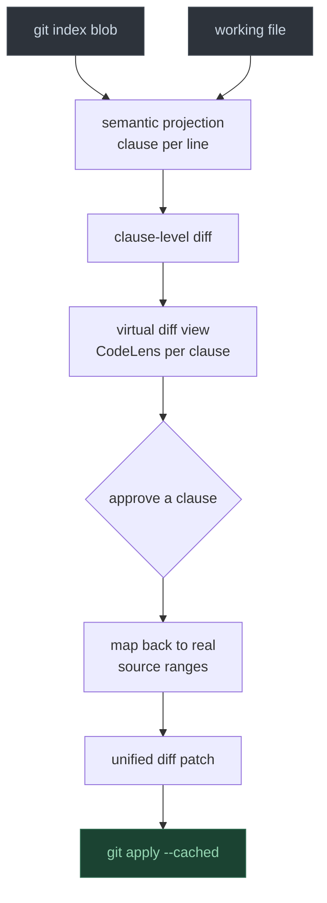

# Semantic Diff

A VS Code extension for reviewing and staging prose changes in git at **clause granularity**. For a writer, the meaningful unit of change is the clause — a rephrased argument, a softened claim, a dropped qualifier — not the line. Semantic Diff projects prose onto a clause-per-line review surface, diffs it there, and lets you stage each clause change independently.

## How it works



Key properties:

- **The projection is never authoritative.** The real file is the source of truth. Staged replacement text is always sliced from the real working file — never from the projection — so normalized whitespace and synthetic breaks can never leak into the repository.
- **Diff basis is index vs working tree** (not HEAD), so staging a clause never conflicts with already-staged content, and staged clauses naturally disappear from the diff.
- **Reflow-resistant.** Hard wraps inside a clause are normalized to spaces in the projection (with exact source mapping), so rewrapping a paragraph produces no diff at all.
- **Markdown-aware.** Frontmatter, code fences (`` ` ``` ``, `~~~`, `:::` Quarto divs), math blocks (`$$`), tables, blockquotes, and headings pass through verbatim. Clause breaking never fires inside inline code or `[@citations]`.
- **List-item aware.** Multi-sentence list items are split into clause lines; the list marker stays on the first clause and continuation clauses are synthetically indented to make the list structure obvious.
- **The working tree is never modified.** Only `git apply --cached` is ever run.

## Features

### Clause-level diff and staging

Open the semantic diff for any file in your git repo. Each changed clause gets a CodeLens row:

- **[Stage N clause(s)]** — writes the change to the git index via `git apply --cached`
- **[Ignore]** — hides the change for this session without staging it
- **[Show raw]** — opens VS Code's native git diff for the underlying source location

### Move detection

When a paragraph or sentence is moved to a different part of the file, both sides are highlighted in **teal** and linked as a move pair. CodeLens shows:

- **[↕ Moved from here — Stage move]** / **[↕ Moved here — Stage move]** — stages both the deletion and the insertion atomically
- **[Split]** — treats the two sides as independent delete + insert if you want to stage them separately
- **[Ignore]** — hides the pair

### Historical diff between commits

Compare any two refs (commits, branches, tags) with the same clause-level view. The diff is read-only — no staging actions — so you can review prose history without risk.

### Book-level diff (bookdown / quarto)

For R Markdown (`_bookdown.yml`) or Quarto (`_quarto.yml`) projects, open a single compiled diff over all chapter files in render order. Staging maps each clause change back to the correct chapter file.

### SCM panel integration

Files with pending clause changes appear in the Source Control panel with a change count. Clicking a file opens its semantic diff.

### Keyboard shortcuts

| Key | Action |
|-----|--------|
| `Alt+]` | Go to next change |
| `Alt+[` | Go to previous change |
| `Alt+S` | Stage clause at cursor (in diff view) |

### Status bar

Shows the clause number at the cursor position in the original file (`Clause N`).

## Commands

| Command | Description |
|---------|-------------|
| `Semantic Diff: Open Semantic Diff` | Open the clause diff for the active file |
| `Semantic Diff: Open Semantic Diff Between Commits…` | Compare two refs (read-only) |
| `Semantic Diff: Open Book Diff (bookdown / quarto)` | Open a compiled diff over all chapters |
| `Semantic Diff: Stage Selected Semantic Hunk` | Stage the clause at the cursor |
| `Semantic Diff: Stage All Semantic Hunks` | Stage every safe clause change in the active diff |
| `Semantic Diff: Stage All Changes in All Files` | Stage all safe changes across all open sessions |
| `Semantic Diff: Go to Next Change` | Navigate to the next changed clause |
| `Semantic Diff: Go to Previous Change` | Navigate to the previous changed clause |
| `Semantic Diff: Toggle Semantic Projection` | Switch between projection and raw text |
| `Semantic Diff: Toggle Split/Inline View` | Toggle split vs inline diff pane |
| `Semantic Diff: Toggle Clause Numbers in Editor` | Show/hide `[N]` clause index annotations |

## Settings

| Setting | Default | Description |
|---------|---------|-------------|
| `semanticDiff.conjunctionMinLength` | `60` | Minimum clause length (characters) before a break is inserted before a coordinating conjunction |
| `semanticDiff.ignoreOrderedListNumbering` | `true` | Suppress changes to ordered-list sequence numbers (`1.` → `2.`); item text changes still surface normally |

## Clause rules

Breaks fire:

- After sentence-ending punctuation (`.` `!` `?` `…`), keeping closing quotes and brackets with the sentence. Abbreviations (`e.g.`, `Dr.`, `et al.`, single-letter initials) are not broken.
- Before a coordinating conjunction following a comma (`and`, `but`, `or`, `nor`, `yet`, `so`) when the clause so far is at least `conjunctionMinLength` characters.
- Before a no-comma coordinating conjunction when the preceding clause is long enough **and** a subject pronoun immediately follows — catching compound sentences like `…long clause and I did a thing` without splitting noun phrases like `apples and oranges`.

Breaks never fire inside inline code, brackets `[]`, or parentheses `()`.

## Safety model

A clause change is **stageable** only when it maps cleanly to real source ranges. When clause boundaries shift (an edit splits one clause into two), positional pairing would stage truncated text — those runs are detected and grouped into one atomic unit instead.

Insertions and deletions of whole paragraphs mirror the working file's separators exactly via gap replacement. Anything that cannot be mapped is marked **unsafe** with a reason and a "Show raw" escape hatch; `Stage All` skips unsafe changes and reports the count.

## Development

```bash
npm install
npm test        # compiles and runs the pure-logic test suite (node:test, no VS Code)
```

Press **F5** in VS Code to launch the extension host.

The core pipeline (`projection/`, `diff/`, `git/patchBuilder.ts`) is pure TypeScript with no VS Code dependency and is fully tested, including tests that build patches and apply them with real `git apply --cached` in throwaway repositories.
