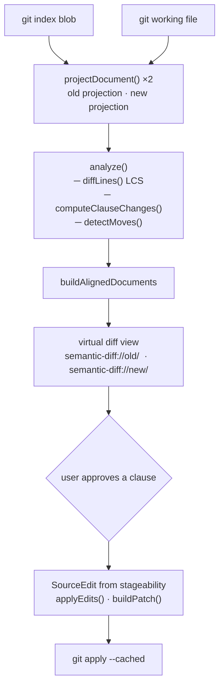
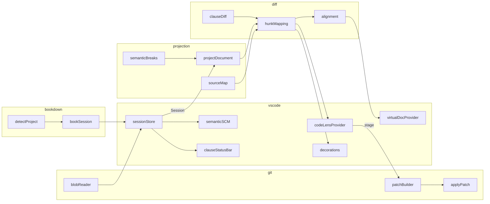

# Semantic Diff — Architecture

## Project shape

```
semantic-diff/
  package.json
  tsconfig.json
  README.md
  src/
    extension.ts                 # activation, command registration
    session.ts                   # per-file diff session (working or historical)
    commands/
      openSemanticDiff.ts        # open clause diff for active file
      openHistoricalDiff.ts      # compare two refs (read-only)
      openBookDiff.ts            # compiled diff over a bookdown/quarto project
      stageSemanticHunk.ts       # stage / stageAll / stageAllFiles / stageMove
      toggleProjection.ts        # toggle projection on/off
    projection/
      projectDocument.ts         # builds the semantic projection of a file
      semanticBreaks.ts          # clause-splitting logic
      sourceMap.ts               # projected offset ↔ source offset mapping
    diff/
      clauseDiff.ts              # LCS diff over projected lines → ClauseChange[]
      hunkMapping.ts             # maps changes to source edits; detects moves
      alignment.ts               # aligns old/new projections with blank-line padding
    git/
      repository.ts              # resolveRepo (git rev-parse --show-toplevel)
      blobReader.ts              # read index blob or ref blob
      patchBuilder.ts            # build a unified diff patch from source edits
      applyPatch.ts              # git apply --cached
    vscode/
      sessionStore.ts            # stores Session and BookSession instances
      virtualDocumentProvider.ts # serves semantic-diff://old/ and semantic-diff://new/
      codeLensProvider.ts        # CodeLens per changed clause
      decorations.ts             # color decorations (inserted/deleted/modified/moved)
      clauseStatusBar.ts         # "Clause N" in the status bar
      clauseNumberDecorations.ts # [N] annotations in the editor gutter
      semanticSCM.ts             # Source Control panel integration
    bookdown/
      detectProject.ts           # find _bookdown.yml or _quarto.yml
      bookSession.ts             # session over concatenated chapter files
    types/
      projection.ts
      diff.ts
      git.ts
  test/
    projection.test.ts
    hunkMapping.test.ts
  fixtures/
    simple.md
    paragraph-reflow.md
    citations.md
    markdown-lists.md
```

## Core data model

### Projection

```ts
type ProjectedToken = {
  text: string
  sourceSpan: { startOffset: number; endOffset: number } | null
  synthetic: boolean
}

type ProjectedLine = {
  text: string
  projStart: number          // offset in projectedText
  projEnd: number
  sourceSpan: { startOffset: number; endOffset: number } | null
  syntheticEol: boolean      // true = break was inserted, not in source
  kind: "prose" | "verbatim" | "blank"
}

type Projection = {
  filePath: string
  originalText: string
  projectedText: string
  tokens: ProjectedToken[]
  lines: ProjectedLine[]
}
```

Every projected character either maps to a source span or is a synthetic newline. Synthetic newlines have `sourceSpan: null` and `synthetic: true`. This invariant is enforced by the tests.

### ClauseChange and stageability

```ts
type ClauseChange = {
  id: string
  kind: "modified" | "inserted" | "deleted"
  grouped: boolean           // true = clause-boundary shift; must stage atomically
  oldStartIndex: number | null
  oldEndIndex: number | null
  newStartIndex: number | null
  newEndIndex: number | null
  anchorOldIndex: number
  anchorNewIndex: number
  moveId?: string            // set when paired with another change as a move
}

type SourceEdit = {
  oldStart: number           // byte offset in the original file
  oldEnd: number
  newText: string            // replacement text (from working file, never projection)
}

type Stageability =
  | { kind: "stageable"; edit: SourceEdit }
  | { kind: "unsafe"; reason: string }
```

### AlignedDocuments

The virtual diff documents are not raw projections — they are aligned by inserting blank lines so that each matched clause pair lands on the same line number in both sides. This is what makes VS Code's diff editor show matching context.

```ts
type AlignedDocuments = {
  oldText: string
  newText: string
  changeLineMap: Map<string, number>      // changeId → line number in aligned text
  syntheticBreakLinesOld: Set<number>     // aligned-doc lines carrying synthetic ¶
  syntheticBreakLinesNew: Set<number>
}
```

## Pipeline



### Module relationships



## Projection

`projectDocument()` in `projection/projectDocument.ts` segments the source into:

- **frontmatter** — verbatim, one source line per projected line
- **fences** — verbatim: `` ` ``` ``, `~~~`, `:::` (Quarto divs), `$$` math blocks
- **structural lines** — headings, blockquotes, tables, horizontal rules, indented code — verbatim
- **list items** — split into clauses; the list marker stays on the first clause, continuation clauses receive a synthetic indent of `markerWidth` spaces
- **paragraphs** — split into clauses; hard wraps inside a clause become replacement tokens (projected `" "`, source span covering the whitespace run) so the projection is reflow-resistant

Hard wraps inside prose clauses are replaced by a single space token whose source span covers the whitespace on both sides of the newline. This means rewrapping a paragraph produces zero diff.

## Clause splitting

`splitClauses()` in `projection/semanticBreaks.ts`:

- Break after `.` `!` `?` `…` followed by whitespace and more content, unless the period belongs to an abbreviation or a single-letter initial.
- Break before `,` + coordinating conjunction when the preceding clause is ≥ `conjunctionMinLength` characters.
- Break before a no-comma conjunction when the preceding clause is long enough and a subject pronoun follows (catches `…long clause and I did a thing` without splitting `apples and oranges`).
- Never break inside backtick spans, `[...]`, or `(...)`.

## Move detection

After `computeClauseChanges()`, `detectMoves()` does a greedy pass over all deleted and inserted changes:

- Extracts the non-blank projected text of each side.
- Computes Dice-coefficient bigram similarity between each deletion and each insertion.
- Pairs the best match above threshold 0.85 (min 20 source characters) and assigns them a shared `moveId`.

Paired changes are shown in teal. `Session` tracks which moves have been split by the user (`splitMoveIds`); a split move reverts to independent delete + insert.

## Book sessions

`BookSession` wraps an inner `Session` over the concatenated text of all chapter files in render order. A `FileSlice[]` records each chapter's `startOffset` and `endOffset` in the concatenated string.

When staging, `sliceFor(edit)` finds which chapter a source edit belongs to by range check, subtracts `slice.startOffset` to get a local edit, and applies it to that chapter's index blob via `git apply --cached`.

The inner `Session` is stored in `SessionStore.sessions` under the project `rootDir` so that the content provider, code lens, and decoration surfaces work without modification. `BookSession` itself is stored in `SessionStore.bookSessions` and is consulted only by staging commands.

## Safety model

`hunkMapping.ts` converts `ClauseChange` values into `AnnotatedChange` (change + stageability):

- **Grouped changes** (clause-boundary shifts where old count ≠ new count) are staged as one atomic unit. Staging only half would write truncated text.
- **Insertions** — the new text is sliced from the real working file, not the projection. The insertion anchor is derived from the preceding source position.
- **Deletions** — the old source span is deleted exactly; no projection text is ever written.
- **Modifications** — old source span replaced by the working-file slice of the new source span.

`applyEdits()` in `patchBuilder.ts` sorts edits by position and rejects overlapping ranges. `buildPatch()` produces a standard unified diff patch for `git apply --cached`.

## Virtual document URIs

```
semantic-diff://old/<filePath>            working session
semantic-diff://new/<filePath>

semantic-diff://old/<filePath>?<key>      historical session (key = filePath\x00oldRef\x00newRef)
semantic-diff://new/<filePath>?<key>

semantic-diff://old/__BOOK__?<rootDir>    book session
semantic-diff://new/__BOOK__?<rootDir>
```

`sessionKeyOf(uri)` returns the decoded query when present, otherwise the path. The content provider and code lens look up sessions by key; for book sessions the key is the `rootDir`, which resolves to the inner `Session` in `SessionStore.sessions`.

## Key design constraints

1. **Never let the projection become authoritative.** Staged text always comes from the real working file.
2. **Never modify the working tree.** Only `git apply --cached`.
3. **Diff basis is index vs working tree.** Staging a clause removes it from the diff immediately; no conflicts with already-staged content.
4. **Source map is the safety gate.** A change is unsafe if its projection range cannot be cleanly mapped back to a source range. The caller decides what to do; the pipeline never silently approximates.
